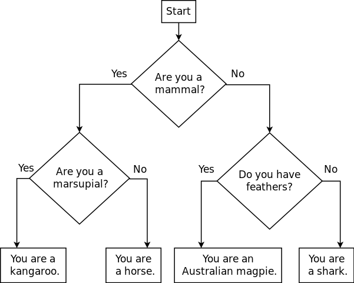

# Getting started

Get started by reading this lab description carefully, completing a [design](../design-template.pdf) to solve the problem described below, and then (in class) working in a small group to finalize a design.

**Do not start writing code** until your group is done with the design.

# First task: design

Consider the following animal classification flowchart:

> 

This flowchart describes how to ask the user some yes/no questions in order to determine what kind of animal she is.  (We'll admit that this may not be 100% accurate for all animals.)

## Designing for control flow

When a problem requires that the program make decisions, we will need to design the *control flow* of the program, meaning how the program will use `if`/`else` statements and loops.

*Pseudo code* is a very helpful way to design control flow.  Pseudo code is a "sketch" of the code you plan to write, omitting less important details, and focusing on the more important details.  For example, let's say you want to write code to determine whether or not the user is eligible to vote.  A pseudo code sketch of the program might look something like:

    prompt user to enter her age

    if ( age is greater than or equal to 18 ) {
        user can vote, print congratulatory message
    } else {
        user can't vote yet, print sympathetic message
    }

Note that the pseudo code sketch omits some details about the program, but indicates clearly how an `if`/`else` statement will be used to print different messages depending on whether or not the user's age meets the criterion for being eligible to vote.

**What you should do**: In the "control flow sketch" section of the design template, write pseudo code showing how the animal classification flowchart can be implemented using `if`/`else` statements.  Show where user interaction (prompts and user input) should occur.  For each `if`/`else` statement, indicate the condition that will be tested.

*Hint*: You will most likely need to use *nested* `if`/`else` statements, meaning that there is an "outer" `if`/`else` statement, and within the if and else blocks of the outer statement, there are "inner" `if`/`else` statements.

# Second task: code

Once your group has reached a consensus regarding how to structure the control flow in the program, translate your design into code.

Get started by downloading [CS101\_Lab05.zip](src/CS101_Lab05.zip) and unzipping it, following the same procedure as the earlier labs.  (Refer to [Lab 1](lab01.html) if you need a refresher.)  Start a Cygwin terminal and change directory into the `CS101_Lab05` directory.  Open the file `Animals.cpp` in Notepad++.  Run the **make** command to compile your code.  Run the command

    ./Animals.exe

when you are ready to test the program.

When you run the program, it should look something like this (user input in <b>bold</b>):

<pre>
Are you a mammal? (1=yes, 0=no) <b>1</b>
Are you a marsupial? (1=yes, 0=no) <b>0</b>
You are a horse.
</pre>

Note that the answers to yes/no questions are implemented by asking the user to enter an integer value, with 0 meaning "no" and 1 meaning "yes".

# Submit

To submit your work, type the command

    make submit

Enter your Marmoset username and password (which you should have received by email.) Note that your password will not be echoed to the screen.
